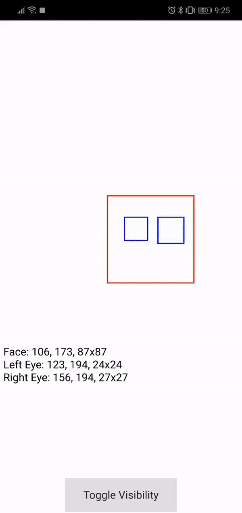

# Face-and-Eye-Detection-for-Android
Face and eye detection for Android using the precompiled [OpenCV](https://opencv.org/) SDK (4.0.1) and Cascade Classifiers. Coded in C++ and Qml using [Qt](qt.io) 5.12 and Qt Creator. If you download this project, make sure to change the location of OpenCV and the target architecture (if needed) so the compiler can find OpenCV and the project can work on your android phone. Click [here](https://opencv.org/releases/) to download OpenCV if needed. You do need to download Qt to run this code since I use the Qml engine. The code is not big at all. Most of the files are Cascade Classifiers I was testing the face feature detector with.

I was quite new to C++ at the time. This project was a great way to learn C++ in addition to such a powerful cross-platform tool like Qt. The Signal and Slot feature offered by Qt is brilliant and I use it in this app.

___

The code:
* *__facefeaturedetector.cpp__*: This class loads the wanted classifiers and starts the capturing and image processing every frame send by the Qml engine.
* *__main.cpp__*: A short main function that starts the Qml engine and the face feature detector.
* *__main.qml__*: This Qml file contains the Camera and VideoOutput objects used to create what you see below. This file sends every frame to the face feature detector.

___

And if you toggle visibility:

